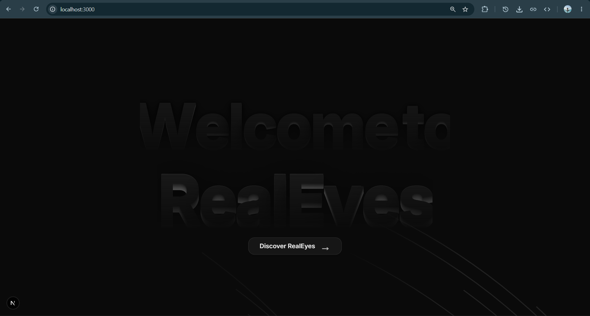
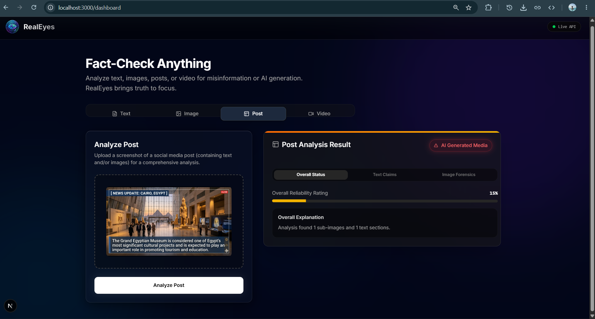
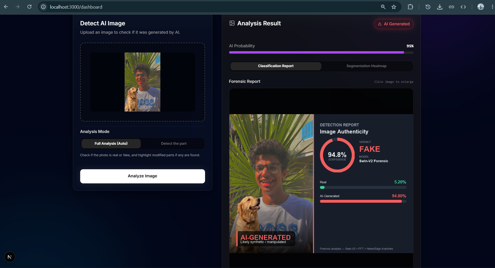
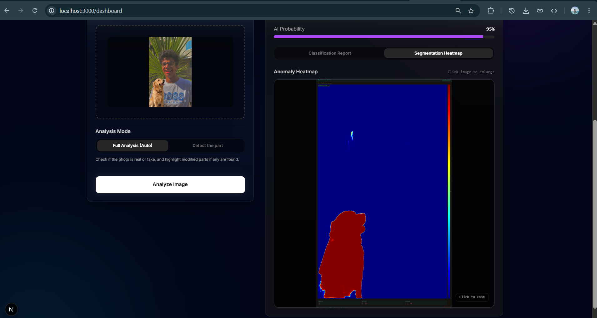
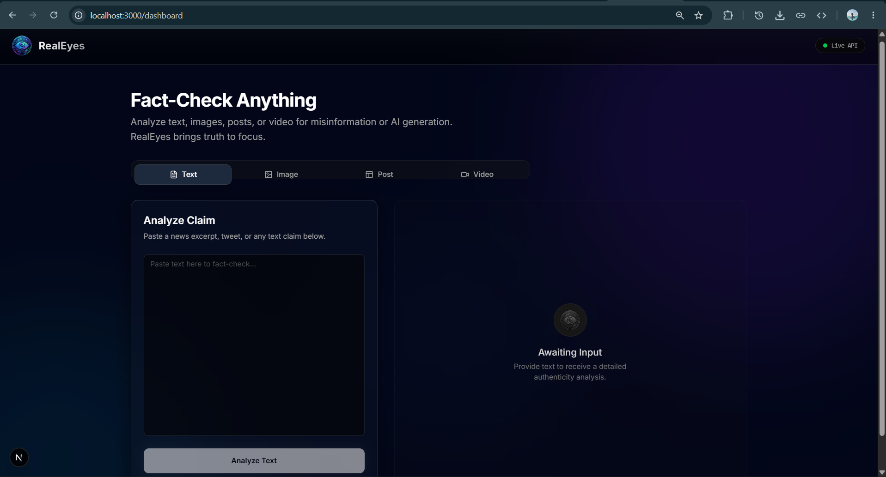
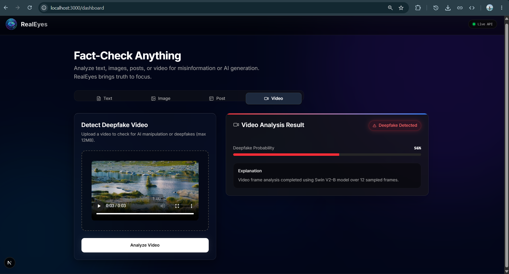

<p align="center">
  
</p>

<h1 align="center">RealEyes</h1>

<p align="center">
  <strong>AI-Powered Deepfake Detection & Misinformation Fact-Checking Platform</strong>
</p>

<p align="center">
  
  
  
  
  
  
  
  
</p>

<p align="center">
  RealEyes is an enterprise-grade, multi-modal detection platform that identifies AI-generated images, deepfake videos, and textual misinformation in real-time — powered by Swin Transformer V2, AXUNet segmentation, DeBERTa NLI, and LLM-assisted bilingual fact-checking across 166+ trusted sources.
</p>

---

## 🎯 What It Does

| Feature | Description |
|---|---|
| **🖼️ Image Forensics** | Upload any image → Swin-V2-B classifies Real vs. AI-Generated with a visual report card, then AXUNet highlights the exact manipulated regions as a heatmap |
| **📝 Text Fact-Checking** | Paste a claim → the system searches the web, ranks sources by Wikipedia WP:RSP trust scores, embeds & reranks with MiniLM + ms-marco, then runs 3-class DeBERTa NLI to verdict SUPPORTS / REFUTES / NEI |
| **📱 Post Analysis** | Upload a social media screenshot → EasyOCR extracts text (EN + AR), computer vision isolates embedded images, then **both** are independently analyzed and cross-referenced |
| **🎬 Video Deepfake Detection** | Upload a video → frames are sampled at 1fps, each classified by Swin-V2-B, probabilities averaged for a final real/fake verdict |
| **🔌 Chrome Extension** | Right-click any image on the web → instant classification + segmentation, directly in your browser |

### 📸 Interactive Feature Showcase

| 🏠 Next.js 16 Glassmorphic Dashboard | 🏗️ Multi-Modal System Overview |
| :---: | :---: |
|  |  |
| **Animated UI with Gooey Morphing Text & Custom Background Paths** | **End-to-End Misinformation & Deepfake Verification Engine** |

| 🖼️ Swin-V2-B Real vs. AI Classification | 🔬 AXUNet Pixel-Level Segmentation |
| :---: | :---: |
|  |  |
| **Real-Time Probability Bars & Visual Confidence Score** | **Forensic Heatmap Isolating Manipulated Pixels** |

| 📰 Bilingual Text Fact-Checking | 🎬 Video Deepfake Frame Analysis |
| :---: | :---: |
|  |  |
| **DeBERTa NLI Verdict with WP:RSP Source Ranking** | **Frame-by-Frame Swin-V2 Sampling & Averaging** |

---

## 🏗️ System Architecture & Algorithmic Pipelines

RealEyes is architected as a decoupled, multi-modal verification engine that isolates high-throughput client applications from GPU-intensive deep learning inference pipelines. By separating frontend presentation from PyTorch tensor orchestration, the platform achieves sub-second classification latency while preventing GPU VRAM exhaustion under concurrent traffic.

### 1. Multi-Modal Ingestion Layer (Client Gateways)
* **Next.js 16 Glassmorphic Dashboard:** Built on the React 19 App Router with Radix UI primitives and Framer Motion. Handles multipart image/video uploads, streaming fact-checking progress bars via SSE/polling, and renders interactive forensic heatmaps.
* **Chrome Extension (Manifest V3):** A lightweight background service worker (`background.js`) and drag-to-select DOM overlay (`area-select.js`) that allows users to right-click and verify any web image, screenshot, or article paragraph directly in their browser without context switching.

### 2. Async API Gateway & CUDA Memory Orchestration (`:5001`)
* **Thread-Safe GPU Serialization:** Pre-trained PyTorch models (**Swin-V2-B**: 1.4GB and **AXUNet**: 1.5GB) reside permanently in GPU VRAM (`cuda:0`). To prevent CUDA Out-of-Memory (`OOM`) crashes or tensor race conditions during concurrent requests, the inference engine implements strict serialization using Python `threading.Lock()`.
* **Dynamic Pipeline Routing:** The REST gateway dynamically routes payloads to specialized forensic endpoints (`/predict`, `/verify-text`, `/process-screenshot`, `/classify-video`), automatically scaling processing threads based on payload complexity.

### 3. Deep Learning Computer Vision Pipelines
* **Swin Transformer V2-B (Forensic Classifier):** Leverages hierarchical shifted-window self-attention (`swinv2_base_window12to16_192to256`) fine-tuned on generative GAN and Diffusion artifacts. Analyzes high-frequency pixel anomalies to output a precise Real vs. AI probability score.
* **AXUNet Attention-Gated Segmentation:** An Xception feature extraction backbone coupled with an Attention-UNet decoder. When `real_prob ≤ 85%` or upon manual trigger, AXUNet generates a 2D binary segmentation mask, isolating manipulated pixels and calculating the exact percentage of visual forgery.
* **Video Deepfake Sampler:** Deconstructs uploaded MP4/AVI video streams into uniform 1fps frame sequences (8 to 60 frames), executing Swin-V2-B inference across each frame and applying statistical score averaging for a unified video credibility verdict.

### 4. Bilingual NLP Fact-Checking & RAG Engine
* **Claim Gating & Translation:** Raw input is filtered through two validation gates. Groq `Llama-3.3-70b` classifies if the statement contains checkable empirical claims, while `llm.process_news()` sanitizes OCR noise and translates Arabic statements into standardized English for semantic processing.
* **WP:RSP Trusted Source Crawler:** Executes concurrent DuckDuckGo searches prioritized against a curated registry of **166+ Wikipedia Reliable Sources (WP:RSP)**, utilizing an 8-way parallel downloader with 1-hour URL TTL caching.
* **Dense Vector Retrieval & Cross-Encoder Reranking:** Downloaded articles are chunked into semantic sentences, embedded into dense vector space using **`all-MiniLM-L6-v2`** (22M params), and scored via cosine similarity. Top candidates are re-ranked using **`ms-marco-MiniLM-L-6-v2`** to isolate the highest-fidelity evidence chunks.
* **3-Class DeBERTa Natural Language Inference (NLI):** Evidence pairs are fed into a fine-tuned DeBERTa model that classifies each chunk as `SUPPORTS`, `REFUTES`, or `NOT ENOUGH INFO`. The system aggregates credibility weights, applies strong-refutation override logic, and invokes Groq Llama-3.3 to synthesize a clear, human-readable verification summary citing authoritative sources.

---

## 📋 Prerequisites

| Requirement | Minimum | Recommended | Notes |
|---|---|---|---|
| **Python** | 3.10 | 3.13 | Invoked via `py` on Windows |
| **Node.js** | 18 | 20+ | For the Next.js dashboard |
| **CUDA GPU** | — | 8GB+ VRAM | Optional; CPU fallback works but is slower |
| **Groq API Key** | — | Free tier | Required for text cleaning & claim classification |
| **Disk Space** | 6 GB | 8 GB | Model weights: ~1.4GB (classifier) + ~1.5GB (segmenter) |

---

## 🚀 Quick Start

### 1. Clone & Configure

```bash
git clone https://github.com/YOUR_USERNAME/RealEyes.git
cd RealEyes/realeyes

# Create your environment file from the template
cp .env.example .env
# Edit .env and add your GROQ_API_KEY
```

### 2. Backend Setup

```bash
cd backend

# Install Python dependencies
pip install -r requirements.txt
python -m spacy download en_core_web_sm

# Set your Groq API key (one-time, persists across sessions)
setx GROQ_API_KEY "gsk_your_key_here"    # Windows (PowerShell)
# export GROQ_API_KEY="gsk_your_key_here"  # Linux/macOS

# Start the Flask server
py server.py    # Windows
# python server.py  # Linux/macOS
```

> The server loads all models on startup (~30s with GPU). You'll see `Running on http://127.0.0.1:5001` when ready.

### 3. Frontend Setup

```bash
cd frontend

npm install
npm run dev
```

> Open **http://localhost:3000** in your browser.

### 4. Chrome Extension (Optional)

1. Open `chrome://extensions` in Chrome.
2. Enable **Developer mode** (top right toggle).
3. Click **Load unpacked** → select the `extension/` folder.
4. Right-click any image on the web → **RealEyes: Analyze This Image**.

---

<details>
<summary><b>🔬 Backend Pipeline Deep-Dive</b></summary>

### Image Classification (`/predict`)

1. Receives a base64 data URL or remote image URL.
2. Decodes and saves to a temp file.
3. Loads through `load_image()` → PIL preprocessing.
4. **Swin-V2-B** (`bestv_3.3.pth`, 1.4GB) classifies as Real (0) or Fake (1).
5. Generates a visual report card with probability bars.
6. If `real_prob ≤ 85%` OR `forceSeg=true`, **AXUNet** (`checkpoint_epoch_21.pth`, 1.5GB) produces a pixel-level segmentation heatmap highlighting manipulated regions.
7. GPU inference is serialized via `threading.Lock()` to prevent CUDA OOM under concurrent requests.

### Text Fact-Checking (`/verify-text-start` → `/verify-progress/:id`)

1. **Gate 1 (heuristic):** Rejects empty/short/non-textual input.
2. **Gate 2 (LLM classifier):** Groq Llama-3.3-70b determines if the text is a *checkable factual claim* (filters greetings, opinions, ads).
3. **Bilingual cleaning:** `llm.process_news()` fixes OCR errors, strips metadata, and translates Arabic→English.
4. **Web search:** DuckDuckGo queries with WP:RSP trusted-first batching (166 domains, batched into site: queries).
5. **Parallel fetch:** 8-way concurrent download with URL caching (TTL=1h, max=200).
6. **Evidence selection:** Sentence chunking → MiniLM-L6 embedding → cosine similarity → ms-marco cross-encoder reranking → domain dedup (max 2 chunks/domain).
7. **NLI verdict:** 3-class DeBERTa (SUPPORTS / REFUTES / NEI) with credibility-weighted aggregation and strong-refutation override.
8. **Multi-source verification:** Counts independent agreeing domains, trusted sources, and contradictions.
9. **LLM explanation:** Groq generates a 2-3 sentence human-readable explanation citing the sources.

### Screenshot Analysis (`/process-screenshot`)

1. EasyOCR extracts text blocks (EN + AR) with bounding boxes.
2. CV pipeline detects image regions: variance map → morphological close/open → contour detection → UI bar exclusion.
3. Collage splitter breaks packed regions into sub-photos via seam detection.
4. Each sub-image is independently classified + segmented.
5. Each text bucket (outside/inside images) runs through the full fact-checking pipeline.
6. Results are aggregated into a combined post verdict.

### Video Analysis (`/classify-video`)

1. Saves uploaded video to temp file.
2. Extracts frames at ~1fps (min 8, max 60 frames).
3. Each frame is classified by Swin-V2-B.
4. Probabilities are averaged across all frames for the final verdict.

</details>

<details>
<summary><b>⚛️ Frontend Component Architecture</b></summary>

### Tech Stack
- **Framework:** Next.js 16 (App Router)
- **UI:** React 19 + shadcn/ui + Radix UI primitives
- **Styling:** Tailwind CSS 4 + custom glassmorphism
- **Animation:** Framer Motion (tab transitions, result reveals, gooey landing text)
- **Typography:** Outfit (headings) + Inter (body) via Google Fonts

### Page Structure
```
src/app/
├── page.tsx              # Animated landing page (GooeyText → BackgroundPaths)
├── layout.tsx            # Root layout with font loading
├── globals.css           # Design tokens, animations, glass scrollbar
└── dashboard/
    └── page.tsx          # Main 4-tab analysis dashboard (1200 lines)
```

### Key Components (`src/components/ui/`)
| Component | Purpose |
|---|---|
| `gooey-text-morphing.tsx` | SVG filter-based morphing text animation for the landing page |
| `background-paths.tsx` | Animated SVG path background with "Enter Dashboard" CTA |
| `tabs.tsx` | Radix Tabs with framer-motion sliding pill indicator |
| `progress.tsx` | Customizable linear progress bar with dynamic indicator colors |
| `card.tsx` | Glassmorphic container with backdrop blur and inner border |

</details>

<details>
<summary><b>🔌 Chrome Extension Architecture</b></summary>

### Manifest V3 Extension
- **Popup** (`popup.html/js`): Quick-access menu with "Analyze Image" button.
- **Background** (`background.js`): Service worker managing context menu registration and message routing.
- **Area Select** (`area-select.js`): Content script for drag-to-select image regions on any webpage.
- **State** (`state.js`): Shared state management across extension pages.
- **Report** (`report.html/js`): Classification result display with heatmap viewer.
- **Verdict** (`verdict.html/js`): Text fact-checking result display with source citations.
- **Loading** (`loading.html/js`): Progress overlay during analysis.
- **Sender** (`sender.js`): HTTP client for Flask API communication.

### Flow
```
Right-click image → Context menu "RealEyes" → background.js captures image URL
→ sender.js POST to Flask /predict → loading.html shows progress
→ report.html renders classification + segmentation results
```

</details>

<details>
<summary><b>🧠 Model Weights & Training</b></summary>

### Classification Model — Swin Transformer V2-B
- **Architecture:** `swinv2_base_window12to16_192to256` (timm)
- **Weights:** `backend/models/classification/bestv_3.3.pth` (1.4 GB, EMA)
- **Training:** Custom forensic fine-tuning on real vs. AI-generated image dataset
- **Details:** See `docs/training_log.txt` for full epoch-by-epoch metrics

### Segmentation Model — AXUNet
- **Architecture:** Xception backbone + UNet decoder with attention gates
- **Weights:** `backend/models/segmentation/checkpoint_epoch_21.pth` (1.5 GB)
- **Task:** Pixel-level binary segmentation of manipulated regions
- **Output:** Overlay heatmap + region analysis (manipulated area %, pixel count)

### NLI Model — DeBERTa (3-class)
- **Architecture:** Fine-tuned DeBERTa for Natural Language Inference
- **Location:** `backend/fact_checker/nli_model/`
- **Labels:** SUPPORTS (0), REFUTES (1), NOT ENOUGH INFO (2)
- **Usage:** Verdict generation for text fact-checking pipeline

### Embedding & Reranking
- **Embedder:** `sentence-transformers/all-MiniLM-L6-v2` (22M params)
- **Reranker:** `cross-encoder/ms-marco-MiniLM-L-6-v2` (22M params)

</details>

---

## 📁 Repository Structure

```
realeyes/
├── .env.example                    # Environment variables template
├── .gitignore                      # Git exclusion rules
├── README.md                       # This file
├── docker-compose.yml              # Multi-service container orchestration
│
├── backend/                        # Python Flask API server
│   ├── server.py                   # Flask entry point (all endpoints)
│   ├── requirements.txt            # Consolidated Python dependencies
│   ├── Dockerfile                  # Container image definition
│   ├── results/                    # Generated report cards & heatmaps
│   ├── models/
│   │   ├── classification/         # Swin-V2-B model & inference script
│   │   └── segmentation/           # AXUNet model & inference script
│   ├── screenshot/                 # EasyOCR + CV region detection
│   │   ├── handler.py              # Screenshot extraction pipeline
│   │   └── llm.py                  # Groq LLM text cleaning wrapper
│   └── fact_checker/               # DeBERTa NLI fact-checking engine
│       ├── checker_en.py           # English fact-checker (978 lines)
│       ├── checker_ar.py           # Arabic-aware bilingual wrapper
│       ├── nli_model/              # Fine-tuned DeBERTa weights
│       └── semantic_crawler/       # Trust scoring & web utilities
│
├── frontend/                       # Next.js 16 React dashboard
│   ├── package.json
│   ├── src/app/                    # App Router pages
│   │   ├── page.tsx                # Animated landing page
│   │   └── dashboard/page.tsx      # Main analysis dashboard
│   └── src/components/ui/          # Reusable UI components
│
├── extension/                      # Chrome Extension (Manifest V3)
│   ├── manifest.json
│   ├── background.js, popup.js, ...
│   └── icons/
│
├── docs/                           # Engineering documentation
│   ├── ARCHITECTURE.md             # System architecture narrative
│   ├── API_REFERENCE.md            # REST API documentation
│   ├── BENCHMARKS.md               # Empirical evaluation results
│   ├── ADR-001-monolith-flask-server.md
│   ├── ADR-002-trusted-source-ranking.md
│   ├── ADR-003-bilingual-fact-checking.md
│   ├── Report.docx                 # Academic graduation report
│   ├── Research_Paper.pdf          # Published research paper
│   └── training_log.txt            # Model training metrics
│
├── scripts/                        # Setup & utility scripts
│   ├── setup.ps1                   # Windows environment setup
│   └── setup.sh                    # Linux/macOS environment setup
│
└── .github/workflows/
    └── ci.yml                      # GitHub Actions CI pipeline
```

---

## 📚 Documentation

| Document | Description |
|---|---|
| [`docs/ARCHITECTURE.md`](docs/ARCHITECTURE.md) | Full system architecture narrative and design rationale |
| [`docs/API_REFERENCE.md`](docs/API_REFERENCE.md) | REST API endpoints, JSON schemas, and example requests |
| [`docs/BENCHMARKS.md`](docs/BENCHMARKS.md) | Empirical evaluation: accuracy, latency, and comparison tables |
| [`docs/ADR-001`](docs/ADR-001-monolith-flask-server.md) | Why we chose a monolithic Flask server over microservices |
| [`docs/ADR-002`](docs/ADR-002-trusted-source-ranking.md) | Why we use Wikipedia WP:RSP for source credibility scoring |
| [`docs/ADR-003`](docs/ADR-003-bilingual-fact-checking.md) | Why we translate Arabic→English before NLI instead of training bilingual |

---

## 🧪 Testing & Verification

```bash
# Backend smoke test (verify models load)
cd backend && py -c "import server; print('All models loaded successfully')"

# Frontend build verification
cd frontend && npm run build

# Backend lint (requires ruff)
pip install ruff && ruff check backend/

# Frontend type check
cd frontend && npx tsc --noEmit
```

---

## 🤝 Contributing

1. Fork the repository.
2. Create a feature branch: `git checkout -b feat/your-feature`.
3. Commit using [Conventional Commits](https://www.conventionalcommits.org/): `git commit -m "feat: add new endpoint"`.
4. Push and open a Pull Request.

---

## 📄 License

This project is licensed under the **MIT License**. See [LICENSE](LICENSE) for details.

---

<p align="center">
  <sub>Built with ❤️ as a graduation project — architected to production standards.</sub>
</p>
