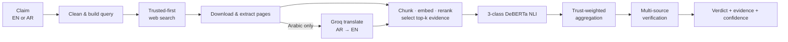
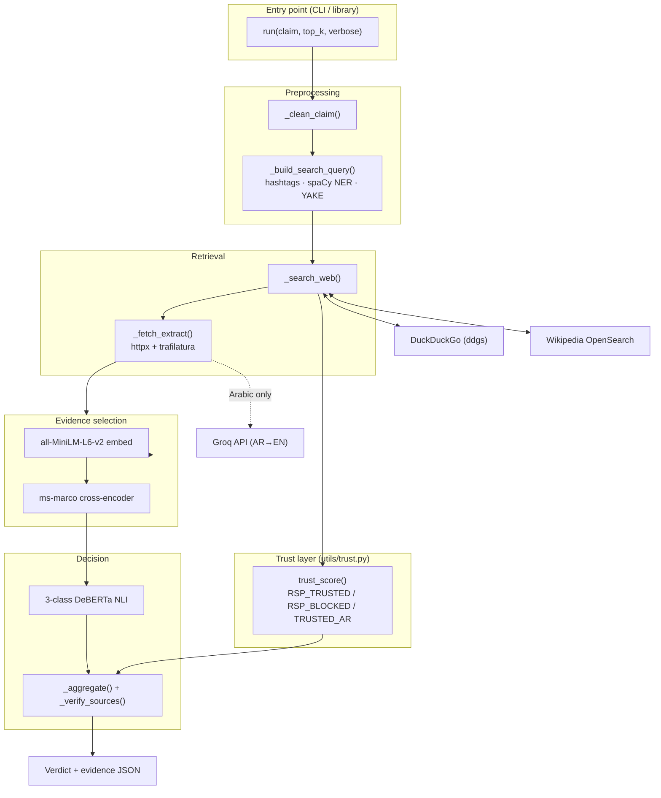
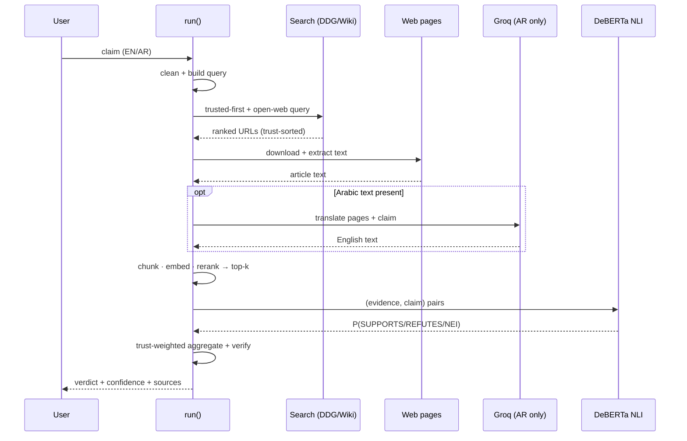
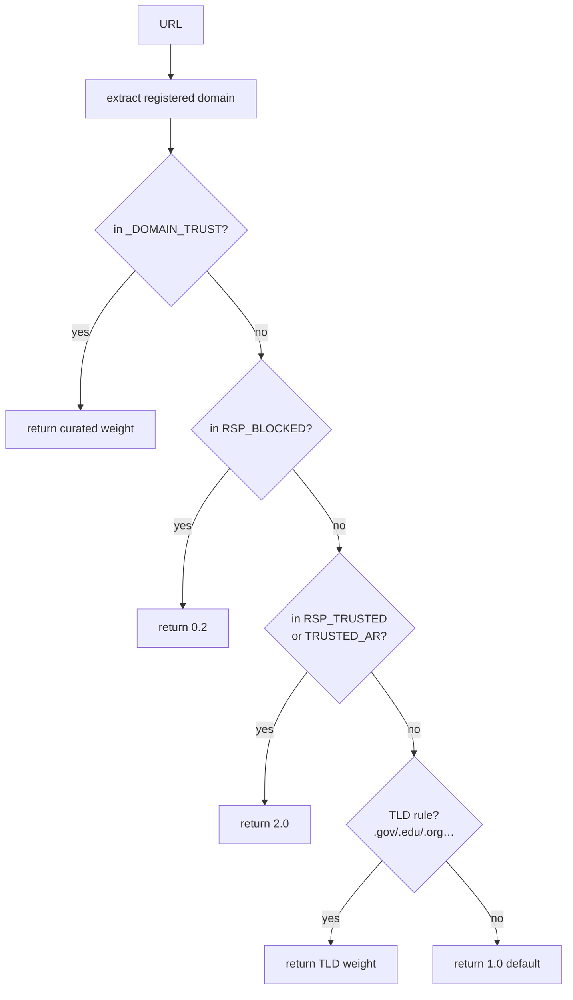
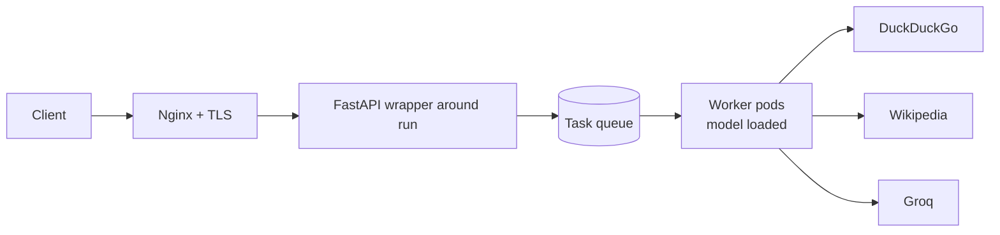

# Live-Web Fact-Checker 🔍

> An automated, explainable fact-checking engine that verifies a claim — in
> **English or Arabic** — against **live web evidence**, ranks that evidence by
> relevance *and source trustworthiness*, and classifies the claim as
> **SUPPORTS / REFUTES / NOT ENOUGH INFO** using a fine-tuned transformer model.

---

## Table of Contents

1. [Project Overview](#1-project-overview)
2. [Features](#2-features)
3. [Tech Stack](#3-tech-stack)
4. [System Architecture](#4-system-architecture)
5. [Complete Pipeline Explanation](#5-complete-pipeline-explanation) ← **most important**
6. [Folder Structure](#6-folder-structure)
7. [Installation Guide](#7-installation-guide)
8. [Configuration](#8-configuration)
9. [External APIs & Integrations](#9-external-apis--integrations)
10. [Data & Models (instead of a database)](#10-data--models)
11. [Machine Learning / AI](#11-machine-learning--ai)
12. [Security](#12-security)
13. [Performance & Scalability](#13-performance--scalability)
14. [Deployment](#14-deployment)
15. [Testing](#15-testing)
16. [Troubleshooting](#16-troubleshooting)
17. [Future Improvements](#17-future-improvements)
18. [Contribution Guide](#18-contribution-guide)
19. [License](#19-license)
20. [Contact](#20-contact)

---

## 1. Project Overview

### Purpose
Misinformation spreads faster than people can manually verify it. This project
is an **end-to-end automated fact-checker**: you give it a claim (a clean
sentence *or* a messy viral social-media post), and it returns a reasoned
verdict backed by real, citable web sources.

### The problem it solves
Manual fact-checking is slow and doesn't scale. Naïve "ask an LLM" approaches
hallucinate and can't cite sources. This system instead:

- retrieves **real, live evidence** from the open web for every claim (no
  pre-built database that can go stale),
- prefers **trustworthy sources** (Wikipedia's community-vetted reliability list)
  and **drops known misinformation domains**,
- makes the final decision with a **specialized NLI model**, not a generative
  one, so each verdict is grounded in retrieved text and is **explainable**
  (you see which sources voted which way and why).

### Main goals
| Goal | How it's met |
|---|---|
| **Grounded verdicts** | Every decision is computed from retrieved evidence, never invented. |
| **Source trust** | Trust scores (WP:RSP) order search results *and* weight the verdict. |
| **Explainability** | Per-source labels, probabilities, and a multi-source "verified" flag. |
| **Bilingual** | Auto-detects Arabic and translates only what the model needs (cost-aware). |
| **Reproducibility** | Deterministic settings (`temperature=0`, fixed thresholds). |

### Real-world use case
A journalist, moderator, or researcher pastes a viral WhatsApp/X post
(*"🚨 Vaccines cause autism!! #vaccines"*). The tool searches fact-checkers and
reputable outlets, reads the most relevant passages, and returns **REFUTES —
verified by 2 independent trusted sources**, with the supporting snippets.

### High-level architecture overview



It is a **command-line / library tool** (a Python `run()` function). There is no
web frontend, login system, or server component — see
[§4](#4-system-architecture) and [§14](#14-deployment) for why and what a
deployment would look like.

---

## 2. Features

| Feature | What it does |
|---|---|
| **Live web retrieval** | Searches DuckDuckGo + Wikipedia in real time for each claim — no stale index. |
| **Trusted-first search** | Restricts the first search pass to reputable domains via the `site:` operator (batched), so trusted pages are retrieved first. |
| **WP:RSP trust scoring** | Source credibility is anchored to Wikipedia's *Perennial Sources* list (~166 reliable, ~256 unreliable/blocked), not hand-guessed numbers. |
| **Misinformation blocklist** | Known anti-vax / conspiracy / content-farm domains are dropped before they can influence a verdict. |
| **Semantic evidence selection** | Bi-encoder embeddings + a cross-encoder re-ranker pick the most relevant passages; domain de-duplication stops one site dominating. |
| **3-class NLI verdict** | A fine-tuned DeBERTa model outputs calibrated SUPPORTS / REFUTES / NOT ENOUGH INFO probabilities per source. |
| **Trust-weighted aggregation** | Each source's vote is weighted by relevance × credibility; a strong-refutation override busts well-documented myths. |
| **Multi-source verification** | Marks a verdict *verified* only when ≥2 independent domains agree and ≥1 is trusted. |
| **Arabic support (unique)** | Auto-detects Arabic, searches in Arabic, and uses Groq LLM translation **only** where the English model needs it — keeping cost low. |
| **Social-media normalization** | Strips emojis, hashtags, mentions, and engagement bait into a clean claim + a focused query. |
| **Explainable output** | Prints every source's label, S/R/N probabilities, retrieval score, and trust tier. |
| **Built-in test batteries** | `--news`, `--social`, `--batch` run curated claim sets (EN + AR) for evaluation. |

---

## 3. Tech Stack

| Category | Technology | Role in this project |
|---|---|---|
| **Language** | Python 3.10+ | Entire pipeline. |
| **ML framework** | PyTorch ≥ 2.3 | Backend for the transformer models. |
| **Transformers** | Hugging Face `transformers` ≥ 4.41 | Loads & runs the local 3-class DeBERTa NLI model. |
| **Embeddings / rerank** | `sentence-transformers` ≥ 3.0 | `all-MiniLM-L6-v2` (bi-encoder) + `ms-marco-MiniLM-L-6-v2` (cross-encoder). |
| **NLI model** | Fine-tuned **DeBERTa-v3** (`best_modeldeberta3-class/`) | Produces the SUPPORTS/REFUTES/NEI verdict. |
| **NLP utilities** | spaCy ≥ 3.7 (`en_core_web_sm`), YAKE ≥ 0.4 | Named-entity + statistical keyword extraction for query building. |
| **HTTP** | `httpx` ≥ 0.27 | Page downloads + Wikipedia API calls. |
| **Search** | `ddgs` (DuckDuckGo) | Web search (trusted-first + open web). |
| **Content extraction** | `trafilatura` ≥ 1.10 | Pulls the main article text out of raw HTML. |
| **Numerics** | NumPy ≥ 1.26 | Vector math (cosine similarity, argsort). |
| **Translation API** | `groq` ≥ 0.11 (Llama 3.3 70B) | Arabic→English translation (Arabic pipeline only). |
| **External APIs** | DuckDuckGo, Wikipedia OpenSearch, Groq | Search, reference lookup, translation. |
| **Databases** | *None used by the fact-checker* | Verdicts run against the live web; no persistence layer. |
| **Frontend / Backend server** | *None* | CLI / importable library. |
| **Deployment** | *Local CLI* (containerization proposed, [§14](#14-deployment)) | — |

> **Note on `semantic_crawler/`:** the repo also contains a larger pre-existing
> semantic-crawler package (with its own ChromaDB/FAISS store and optional
> FastAPI). The live-web fact-checker **does not use it** except for one shared
> file: `semantic_crawler/utils/trust.py`. See [§6](#6-folder-structure).

---

## 4. System Architecture

This is a **single-process, synchronous Python pipeline**. There is intentionally
no frontend, database, authentication, or message queue — the unit of work is one
claim, processed start-to-finish by the `run()` function. The only network
dependencies are three external services.

### Component diagram



### Data flow (end to end)



**Authentication flow:** none. The only credential is the optional
`GROQ_API_KEY` environment variable used for Arabic translation (see
[§12](#12-security)).

---

## 5. Complete Pipeline Explanation

The driver is `run(claim, top_k=5, verbose=False)` in
`test_live_web4withoutgroq.py` (English) / `test_live_web4_ar.py` (English +
Arabic). Progress prints as `[1/4] … [4/4]`. We trace the example claim
**"Vaccines cause autism."** (expected **REFUTES**) through every stage.

---

### Stage 1 — Claim Cleaning

**Purpose** — Strip social-media noise so the model and embedder see clean text.

**Input** — Raw claim/post string.

**Process** — `_clean_claim(raw)` applies, in order:
1. `re.sub(r"https?://\S+", " ")` — remove URLs
2. `re.sub(r"@\w+", " ")` — remove @mentions
3. `raw.replace("#", " ")` — drop the `#` but keep the tag word
4. `re.sub(r"[^\w\s.,!?'\"-]", " ")` — strip emojis/symbols
5. `[!?]{2,}` and `\.{2,}` → `". "` — collapse shouting into sentence breaks
6. `\s+` → single space, then `.strip()`

**Output** — A clean sentence: `"BREAKING 🚨 Vaccines cause autism!! #vaccines"` → `"BREAKING. Vaccines cause autism. vaccines"`.

**Technologies** — Python `re`.

**Why this step exists** — Emojis, hashtags, and `!!!` confuse both the embedder
and the NLI model; removing them improves retrieval and classification.

**Error handling** — Pure string ops; cannot fail on valid input.

**Optimization** — Single linear pass of cheap regex substitutions; negligible cost.

---

### Stage 2 — Search-Query Construction

**Purpose** — Turn a verbose claim into a focused keyword query.

**Input** — The **raw** claim (for hashtags) + the cleaned text (for NER/keywords).

**Process** — `_build_search_query(raw, max_terms=15)` builds the query in three
priority layers, de-duplicating as it goes:
- **Layer 1 — Hashtags:** `re.findall(r"#(\w{2,})", raw, re.UNICODE)`. `\w` is
  Unicode-aware, so **Arabic tags work** (`#كأس_العالم` → `كأس العالم`);
  underscores are split into words. Added first.
- **Layer 2 — Named entities:** spaCy `en_core_web_sm` NER extracts people,
  places, orgs, dates regardless of position.
- **Layer 3 — YAKE keywords:** statistical single-word keywords fill remaining
  slots (no stopword list needed). Falls back to document-order tokens if YAKE
  is unavailable.

**Output** — Up to 15 keywords: `"vaccines autism cause"`.

**Technologies** — `re`, spaCy, YAKE.

**Why** — Search engines reward focused queries; raw posts dilute the signal.

**Error handling** — spaCy/YAKE imports are wrapped in `try/except`; if missing,
the other layers still run (graceful degradation).

**Optimizations** — spaCy model is a lazy singleton (`_get_spacy_nlp`); layers
short-circuit once `max_terms` is reached.

---

### Stage 3 — Trusted-First Web Search

**Purpose** — Retrieve candidate evidence URLs, prioritizing reputable sources.

**Input** — The keyword query; `n = top_k + 5 = 10`.

**Process** — `_search_web(query, n)` runs three passes:
1. **Trusted-only (`site:`):** `_trusted_site_queries()` splits the trusted
   domain list into **batches of 25** (`_SITE_BATCH`) — DuckDuckGo can't take all
   ~166 in one query — producing `"<query> site:a OR site:b OR …"`. Batches run
   first, **1.5 s apart** (`_SEARCH_DELAY`, anti-throttle), stopping early once
   the URL budget (`n + 5`) is filled.
2. **Open web:** a normal DuckDuckGo query fills remaining slots (one retry with
   a shortened query if empty).
3. **Wikipedia:** the OpenSearch API adds encyclopedia articles.

Every URL passes `_is_blocked()` (drops `_DOMAIN_BLOCKLIST` ∪ `RSP_BLOCKED`).
Finally the pool is **sorted by `trust_score` descending** and truncated to the
top **15**:
```python
urls.sort(key=_credibility, reverse=True)
return urls[:n + 5]
```

**Output** — ≤ 15 URLs, most-trusted first.

**Technologies** — `ddgs`, `httpx` (Wikipedia), `utils/trust.py`.

**Why** — Trusted-first retrieval means fact-checker/authority pages survive the
cutoff and dominate the evidence pool.

**Error handling** — All search calls are `try/except` → return `[]` on failure;
the pipeline continues with whatever was found.

**Optimizations** — Early-stop avoids firing all ~7 batches; inter-query delay
prevents rate-limiting; stable trust-sort floats trusted hits forward.

**Challenges** — DuckDuckGo rate-limits bursts of `site:` queries; the delay +
early-stop mitigate this (see [§16](#16-troubleshooting)).

---

### Stage 4 — Download & Content Extraction

**Purpose** — Get clean article text from each URL.

**Input** — The list of URLs.

**Process** — `_fetch_extract(url)` for each: `httpx.get` (browser User-Agent,
follows redirects, 15 s timeout) → `trafilatura.extract(..., favor_recall=True)`
to isolate the main body. Pages yielding **< 150 characters** (consent walls,
"access denied", JS-only) are **skipped**.

**Output** — `[{url, title, text}, …]` for surviving pages (~8–12 of 15 typical).

**Technologies** — `httpx`, `trafilatura`.

**Why** — Raw HTML is full of nav/ads; the model must see article prose.

**Error handling** — Any download/extraction error → `("", "")` → page skipped;
never crashes the run.

**Optimizations** — The 150-char floor discards junk early, before expensive
embedding.

---

### Stage 5 — Arabic Translation *(Arabic pipeline only)*

**Purpose** — Make Arabic evidence usable by the English-only NLI model, while
keeping search in the original language and translation cost minimal.

**Input** — Retrieved pages + the claim.

**Process** (`test_live_web4_ar.py`):
1. `_has_arabic()` flags Arabic text via Unicode ranges.
2. Each **Arabic page** is translated to English via the **Groq API**
   (`llama-3.3-70b-versatile`, `temperature=0`), capped at `_MAX_PAGE_CHARS =
   6000` chars. English pages are skipped (no API call).
3. The **claim** is translated to English (`claim_en`).
4. (Safety net) any selected chunk still containing Arabic is translated before
   NLI.

**Output** — English page text + `claim_en`; an `AR→EN` line is printed.

**Technologies** — Groq SDK (Llama 3.3 70B).

**Why** — The model is English-only, but searching in Arabic finds Arabic
sources; translating *after* retrieval preserves coverage.

**Error handling** — Missing `GROQ_API_KEY`, missing package, or API error →
**original text is used** and a warning is logged; the pipeline still runs.

**Optimizations / cost** — Only Arabic text is sent; English claims make **zero**
API calls; per-page cap bounds tokens. (Design history: page-level translation
was chosen over translating every chunk for accuracy, with the cap for cost.)

---

### Stage 6 — Evidence Selection (Chunk · Embed · Rerank)

**Purpose** — Reduce many pages to the `top_k = 5` most relevant passages.

**Input** — Pages (English) + the (English) claim.

**Process** — `_select_best_evidence(claim, pages, top_k, chunks_per_page=2)`:
1. **Chunk** — `_chunk_text(text, max_tokens=120, overlap=1)` splits on a
   sentence regex `(?<=[.!?])\s+(?=[A-Z])`, greedily packs sentences up to ~120
   tokens with 1-sentence overlap (fixed 480-char windows if no sentence
   boundaries; chunks < 60 chars dropped).
2. **Embed & score** — claim and chunks → `all-MiniLM-L6-v2` (384-dim,
   L2-normalized). Relevance = dot product (= cosine). Top **2 chunks/page**
   kept; anything `< MIN_RELEVANCE (0.30)` dropped.
3. **Re-rank** — `ms-marco-MiniLM-L-6-v2` cross-encoder re-scores each `(claim,
   chunk)`; final score = `0.6 × cosine + 0.4 × sigmoid(cross-encoder)`.
4. **Diversify** — sort by score, enforce **max 2 chunks per domain**
   (`MAX_PER_DOMAIN`), keep top `top_k`.

**Output** — ≤ 5 chunks, each with `retrieval_score` + source `credibility`.

**Technologies** — `sentence-transformers`, NumPy.

**Why** — The NLI model is accurate but slow; feeding it only the best passages
maximizes signal and minimizes compute.

**Error handling** — Reranker load wrapped in `try/except` (falls back to cosine
only); empty candidate set → returns `[]` (verdict becomes NEI upstream).

**Optimizations** — Bi-encoder pre-filters cheaply; the expensive cross-encoder
runs only on survivors; per-domain cap prevents one site monopolizing the vote.

---

### Stage 7 — Natural-Language Inference

**Purpose** — Decide, per source, whether the evidence supports/refutes the claim.

**Input** — `(evidence_chunk, claim)` pairs.

**Process** — `_predict_nli(claim, texts)` loads the fine-tuned **3-class
DeBERTa** (`best_modeldeberta3-class/`). Each pair is tokenized (evidence =
premise, claim = hypothesis, `max_length=512`), run in **batches of 8**; a
softmax over logits gives `P(SUPPORTS) + P(REFUTES) + P(NEI) = 1`. Labels:
`0=SUPPORTS, 1=REFUTES, 2=NOT ENOUGH INFO`. Uses GPU if available, else CPU.

**Output** — Per chunk: `{label, score, probabilities}`.

**Technologies** — PyTorch, Hugging Face `transformers`.

**Why** — A discriminative NLI model is grounded and explainable, unlike a
generative LLM which can hallucinate.

**Error handling** — Model is a lazy singleton (`_get_nli`); inference under
`torch.no_grad()`.

**Optimizations** — Batched inference; lazy one-time model load; `no_grad`.

---

### Stage 8 — Trust-Weighted Aggregation

**Purpose** — Combine per-source predictions into one verdict + confidence.

**Input** — Evidence chunks + their NLI probabilities.

**Process** — `_aggregate(evidence, preds)`:
1. **Weight** each chunk by `retrieval_score × credibility` (trusted source ≈ 2× an unknown one).
2. **Sum** weighted mass per class (`sup`, `ref`, `nei`) → normalize into shares.
3. **Strong-refutation override:** if any chunk has `P(REFUTES) ≥
   STRONG_REF_THRESHOLD (0.85)` **and** `ref_share ≥ STRONG_REF_SHARE (0.35)` →
   **REFUTES** (busts well-documented myths).
4. **Otherwise:** `sup_share ≥ NEI_MARGIN (0.55)` → SUPPORTS; `ref_share ≥ 0.55`
   → REFUTES; else **NOT ENOUGH INFO**.

**Output** — `(verdict, confidence)`.

**Technologies** — Pure Python/NumPy.

**Why** — Trust weighting lets a Snopes/Reuters page outvote a random blog;
including NEI mass in the denominator makes genuine uncertainty surface honestly.

**Error handling** — Near-zero total weight → `("NOT ENOUGH INFO", 0.0)`.

**Optimization** — O(#chunks) arithmetic; negligible.

---

### Stage 9 — Multi-Source Verification

**Purpose** — Distinguish a robustly-supported verdict from a one-source guess.

**Input** — Evidence + predictions + the verdict.

**Process** — `_verify_sources()` counts distinct **agreeing domains**, how many
are **trusted** (`credibility ≥ TRUSTED_CREDIBILITY = 2.0`), and whether any
trusted source **contradicts**. Marked **✓ VERIFIED** iff verdict ∈
{SUPPORTS, REFUTES} **and** `≥ MIN_INDEPENDENT_SOURCES (2)` domains agree **and**
≥1 is trusted **and** no trusted source contradicts.

**Output** — `{verified, independent_sources, trusted_agree, trusted_contradict,
statement}` with a plain-English explanation.

**Why** — Corroboration across independent reputable sources is the real-world
standard for "verified".

**Error handling** — Operates on already-validated structures; no failure path.

---

### Stage 10 — Output / Result Contract

**Purpose** — Present an explainable, machine-readable result.

**Process / Output** — `run()` prints the verdict banner + per-source breakdown
and returns:
```python
{
  "claim": "...",
  "final_prediction": "REFUTES",
  "confidence": 0.88,
  "evidence": [{url, title, retrieval_score, credibility,
                nli_label, probabilities, snippet}, ...],
  "verification": {verified, independent_sources, trusted_agree, ...},
}
```
The base file's `--json PATH` writes this to disk.

**Why** — A structured contract makes the tool embeddable in other apps and the
console output auditable by a human.

---

### Mathematical Formulation

This summarizes the exact math behind Stages 6–9. (GitHub renders the `$$`
blocks as equations.)

**1. Relevance — cosine similarity (Stage 6).**
Embeddings are L2-normalized by `all-MiniLM-L6-v2`, so cosine reduces to a dot
product. For claim embedding $\mathbf{e}_q$ and chunk embedding $\mathbf{e}_i$:

$$
s^{\cos}_i \;=\; \frac{\mathbf{e}_q \cdot \mathbf{e}_i}{\lVert \mathbf{e}_q\rVert \, \lVert \mathbf{e}_i\rVert} \;=\; \mathbf{e}_q \cdot \mathbf{e}_i
\qquad (\lVert\mathbf{e}\rVert = 1)
$$

A chunk is kept only if $s^{\cos}_i \ge \text{MIN\_RELEVANCE}=0.30$.

**2. Cross-encoder re-rank (Stage 6).**
The cross-encoder outputs a logit $z_i$; it is squashed with the logistic
(sigmoid) function and blended with the cosine score:

$$
\sigma(z_i) = \frac{1}{1 + e^{-z_i}}
\qquad
r_i \;=\; 0.6 \cdot s^{\cos}_i \;+\; 0.4 \cdot \sigma(z_i)
$$

where $r_i$ is the final **retrieval score** of chunk $i$.

**3. Source trust weight (Stage 8).**
Each chunk's voting weight combines relevance and source credibility
$c_i = \text{trust\_score}(\text{url}_i) \in [0.2,\,3.0]$:

$$
w_i \;=\; r_i \cdot c_i
$$

**4. Weighted class mass & shares (Stage 8).**
With per-chunk NLI probabilities $P_i(k)$ for $k \in \{\text{SUP},\text{REF},\text{NEI}\}$:

$$
M_k \;=\; \sum_{i} w_i \, P_i(k),
\qquad
T \;=\; M_{\text{SUP}} + M_{\text{REF}} + M_{\text{NEI}}
$$

$$
\text{sup\_share} = \frac{M_{\text{SUP}}}{T},
\quad
\text{ref\_share} = \frac{M_{\text{REF}}}{T}
$$

**5. Verdict decision rule (Stage 8).**
First the **strong-refutation override**:

$$
\Big(\max_i P_i(\text{REF}) \ge 0.85\Big) \;\wedge\; \big(\text{ref\_share} \ge 0.35\big)
\;\Longrightarrow\; \textbf{REFUTES}
$$

otherwise:

$$
\text{verdict} =
\begin{cases}
\textbf{SUPPORTS}, & \text{sup\_share} \ge 0.55 \\[4pt]
\textbf{REFUTES}, & \text{ref\_share} \ge 0.55 \\[4pt]
\textbf{NOT ENOUGH INFO}, & \text{otherwise}
\end{cases}
$$

Confidence is the winning share (or $\max_i P_i(\text{REF})$ for the override).

**6. Multi-source verification (Stage 9).**
Let $D$ = set of distinct domains whose chunk agrees with the verdict, and
$D_{\text{trust}} = \{ d \in D : c_d \ge 2.0 \}$, with
$D_{\text{contra}}$ = trusted domains that contradict it. Then:

$$
\text{verified} \;=\;
(\text{verdict} \in \{\text{SUP},\text{REF}\}) \;\wedge\;
(|D| \ge 2) \;\wedge\;
(|D_{\text{trust}}| \ge 1) \;\wedge\;
(|D_{\text{contra}}| = 0)
$$

---

## 6. Folder Structure

```
gradprojectFullnewsPart/
│
├── test_live_web4withoutgroq.py   # ★ English fact-checker — the base pipeline (run/search/select/NLI/aggregate)
├── test_live_web4_ar.py           # ★ English + Arabic — imports the base, adds Groq translation + TRUSTED_AR
├── test_live_web5.py              # research variant — trust-weighted, wider chunk selection
│
├── best_modeldeberta3-class/      # fine-tuned 3-class DeBERTa NLI model (config + weights + tokenizer)
│
├── requirements.txt               # Python dependencies
├── README.md                      # this document
│
└── semantic_crawler/              # large pre-existing crawler package — ONLY utils/trust.py is used here
    ├── utils/
    │   └── trust.py               # ★ shared trust scoring: RSP_TRUSTED / RSP_BLOCKED / TRUSTED_AR / trust_score()
    ├── crawler/ indexer/ search/  # full crawler + ChromaDB/FAISS index + retriever (NOT used by the fact-checker)
    ├── storage/ config/ api/      # SQLite metadata, YAML config, optional FastAPI (NOT used by the fact-checker)
    └── data/                      # crawler artifacts (cache, frontier.db) — unrelated to live-web checking
```

| Path | Purpose |
|---|---|
| `test_live_web4withoutgroq.py` | The core engine. All pipeline functions live here. Run directly for English. |
| `test_live_web4_ar.py` | Bilingual entry point. Auto-detects Arabic, translates via Groq, adds Arabic trusted sources. **Recommended.** |
| `test_live_web5.py` | Variant that folds trust into the selection score and widens `chunks_per_page`. For experiments. |
| `best_modeldeberta3-class/` | The local NLI model directory loaded by `transformers`. |
| `semantic_crawler/utils/trust.py` | **The only crawler file the fact-checker imports** — single source of truth for source trust. |
| `semantic_crawler/` (rest) | A standalone crawler/search system kept in the repo but **independent** of the live-web checker. |

---

## 7. Installation Guide

### Prerequisites
- **Python 3.10+**, ~2 GB free RAM, internet access.
- GPU optional (CPU works; first run downloads the embedder + cross-encoder).
- (Arabic only) a free **Groq API key** — <https://console.groq.com>.

### Setup — Windows (PowerShell)
```powershell
python -m venv .venv
.venv\Scripts\activate
pip install -r requirements.txt
python -m spacy download en_core_web_sm

# Arabic translation key (current session):
$env:GROQ_API_KEY = "gsk_your_key_here"
# or permanently (then reopen the terminal):
setx GROQ_API_KEY "gsk_your_key_here"
```

### Setup — Linux / macOS (bash)
```bash
python3 -m venv .venv
source .venv/bin/activate
pip install -r requirements.txt
python -m spacy download en_core_web_sm

export GROQ_API_KEY="gsk_your_key_here"   # Arabic only
```

### Run commands
```bash
python test_live_web4_ar.py --claim "The Eiffel Tower is in Paris." --verbose   # English
python test_live_web4_ar.py --claim "لقاحات كوفيد تسبب التوحد" --verbose          # Arabic
python test_live_web4_ar.py --news     # bilingual battery
```

> **No build step / no database setup** — the tool is interpreted Python and
> stateless. Models download on first use; the NLI model is already in the repo.

---

## 8. Configuration

There is **no `.env` file or config server** — configuration is (a) one
environment variable and (b) module-level constants you edit in code.

### Environment variables
| Variable | Used by | Required? | Purpose |
|---|---|---|---|
| `GROQ_API_KEY` | `test_live_web4_ar.py` | Only for Arabic claims | Auth token for Groq translation. Read from the OS env at runtime. |

### Tunable constants
| Constant | File | Default | Meaning |
|---|---|---|---|
| `MIN_RELEVANCE` | base | `0.30` | Min chunk relevance to keep (Stage 6). |
| `NEI_MARGIN` | base | `0.55` | Below this winning share → NOT ENOUGH INFO (Stage 8). |
| `STRONG_REF_THRESHOLD` | base | `0.85` | Single-chunk REFUTES prob that can override. |
| `STRONG_REF_SHARE` | base | `0.35` | Min refute share for the override. |
| `MIN_INDEPENDENT_SOURCES` | base | `2` | Domains needed for ✓ VERIFIED (Stage 9). |
| `TRUSTED_CREDIBILITY` | base | `2.0` | Credibility threshold for "trusted". |
| `_SITE_BATCH` | base | `25` | Trusted domains per `site:` query. |
| `_SEARCH_DELAY` | base | `1.5` | Seconds between DuckDuckGo queries. |
| `RSP_TRUSTED_WEIGHT` | trust.py | `2.0` | Weight for WP:RSP-reliable domains. |
| `GROQ_MODEL` | `_ar` | `llama-3.3-70b-versatile` | Translation model. |
| `_MAX_PAGE_CHARS` | `_ar` | `6000` | Cap on Arabic page text sent to Groq. |

**Ports / secrets:** none (no server). The Groq key is the only secret — keep it
in the environment, never commit it.

---

## 9. External APIs & Integrations

The fact-checker **exposes no API of its own** (it's a CLI/library). It
**consumes** three external services:

| Service | Via | Method | Auth | Used for |
|---|---|---|---|---|
| **DuckDuckGo** | `ddgs` library | text search | none | Trusted-first + open-web search (Stage 3). |
| **Wikipedia** | `httpx` GET `…/w/api.php?action=opensearch` | HTTP GET | none | Reference articles (Stage 3). |
| **Groq** | `groq` SDK → `chat.completions.create` | HTTPS POST | `GROQ_API_KEY` | Arabic→English translation (Stage 5). |

### The `run()` "endpoint" (library contract)
| Field | Type | Description |
|---|---|---|
| **Input** `claim` | `str` | Claim/post text (EN or AR). |
| `top_k` | `int` (default 5) | Max evidence chunks. |
| `verbose` | `bool` | Print evidence snippets. |
| **Returns** | `dict` | `{claim, final_prediction, confidence, evidence[], verification{}}` (see [Stage 10](#stage-10--output--result-contract)). |

> The `semantic_crawler/` package ships an **optional FastAPI** (`api/app.py`),
> but it belongs to the crawler subsystem and is **not part of** the live-web
> fact-checker.

---

## 10. Data & Models

This project has **no database** — verdicts are computed against the live web,
so there are no tables, collections, schemas, or indexes to maintain. What
exists instead:

| Asset | Location | Description |
|---|---|---|
| **NLI model** | `best_modeldeberta3-class/` | Fine-tuned DeBERTa weights + tokenizer, loaded locally at inference. |
| **Trust lists** | `semantic_crawler/utils/trust.py` | In-code `frozenset`s: `RSP_TRUSTED` (~166), `TRUSTED_AR` (Arabic), `RSP_BLOCKED` (~256). |
| **Blocklist** | `test_live_web4withoutgroq.py` | `_DOMAIN_BLOCKLIST` of misinformation domains. |
| **Cached models** | HF cache (`~/.cache`) | `all-MiniLM-L6-v2`, `ms-marco-MiniLM-L-6-v2` (downloaded once). |

> The bundled crawler does contain a **ChromaDB/FAISS vector store + SQLite
> metadata** under `semantic_crawler/`, but the live-web fact-checker does not
> read or write them.

### Trust lookup flow



---

## 11. Machine Learning / AI

### Models used at inference
| Model | Type | Role |
|---|---|---|
| **DeBERTa-v3 (3-class)** | Cross-encoder NLI classifier | Final verdict: P(SUPPORTS/REFUTES/NEI). |
| **all-MiniLM-L6-v2** | Bi-encoder (sentence embedding) | Fast relevance scoring (cosine). |
| **ms-marco-MiniLM-L-6-v2** | Cross-encoder re-ranker | Precise re-scoring of top candidates. |

### NLI model architecture & I/O
- **Backbone:** DeBERTa-v3 transformer with a 3-way classification head.
- **Input:** sentence pair `(premise = evidence, hypothesis = claim)`, tokenized to ≤ 512 tokens.
- **Output:** softmax over `{SUPPORTS=0, REFUTES=1, NEI=2}`.

### Inference pipeline (recap of Stages 6–8)
Retrieve → chunk → bi-encoder shortlist (cosine ≥ 0.30) → cross-encoder rerank
(0.6/0.4 blend) → DeBERTa NLI (batched) → trust-weighted aggregation.

### Dataset / training
The NLI model is **provided pre-trained** in `best_modeldeberta3-class/`
(FEVER-style SUPPORTS/REFUTES/NEI fine-tuning). Training code and data are **not
included** in this repo — only the inference artifacts. To reproduce training you
would fine-tune DeBERTa-v3 on a claim-evidence NLI dataset (e.g., FEVER) with a
3-way head.

### Evaluation
Use the built-in batteries (`--news`, `--social`, `--batch`) — each claim has an
`expected` label; the runner prints `PASS/FAIL` and an accuracy tally
(e.g., `4/6 passed`). This is **end-to-end** accuracy (retrieval + model), not
model-only accuracy.

### Feature engineering / preprocessing
Social-media normalization (Stage 1), three-layer query construction (Stage 2),
sentence-window chunking, and L2-normalized embeddings (Stage 6).

---

## 12. Security

This is a local, single-user CLI tool, so the attack surface is small. Still:

| Concern | Status / approach |
|---|---|
| **Authentication / Authorization** | None — no server, no users, no sessions. |
| **Secrets** | Only `GROQ_API_KEY`, read from the environment — never hard-coded or committed. Rotate via the Groq console. |
| **Encryption in transit** | All outbound calls (DuckDuckGo via `ddgs`, Wikipedia, Groq) use HTTPS; `httpx` upgrades/validates TLS. |
| **Input validation** | Claims are treated as text; the misinformation **blocklist** prevents low-quality domains from influencing verdicts. |
| **SSRF / fetch safety** | Only URLs returned by search engines are fetched; `trafilatura` parses HTML (no code execution). |
| **Rate limiting** | Self-imposed `_SEARCH_DELAY` on outbound search calls (politeness, not security). |
| **Data privacy** | Claims are sent to third-party search/translation APIs — don't submit confidential text. |

**Best practices:** run in a virtualenv, keep `GROQ_API_KEY` out of version
control (use a `.gitignore`d env or shell profile), and review the blocklist for
your threat model.

---

## 13. Performance & Scalability

**Current characteristics (per claim):**
- Dominated by **network I/O** (search + page downloads) and **NLI inference**.
- Typical latency: tens of seconds (search delay + ~10 downloads + model passes).

**Optimizations already in place:**
| Technique | Where |
|---|---|
| Lazy singletons (models, spaCy) | loaded once per process |
| Bi-encoder pre-filter before costly cross-encoder | Stage 6 |
| Batched NLI inference + `torch.no_grad()` | Stage 7 |
| Early-stop on trusted search batches | Stage 3 |
| `< 150`-char page skip before embedding | Stage 4 |
| Arabic translation only on Arabic text, page cap | Stage 5 |

**Bottlenecks:** sequential page downloads and the inter-query search delay.

**Scaling ideas (proposed, not implemented):**
- **Async I/O** — `httpx.AsyncClient` to download pages concurrently.
- **Batch/queue** — process many claims via a task queue (Celery/RQ) with workers.
- **GPU inference** + larger NLI batch sizes for throughput.
- **Caching** — memoize page text / translations by URL to speed re-runs.
- **Horizontal scaling** — stateless `run()` parallelizes trivially across workers.

---

## 14. Deployment

**Current state:** runs locally as a **CLI / importable module**. No server,
container, or cloud deployment is included.

**Proposed deployment (not yet implemented)** — for portfolio/production use:



Suggested steps if productionizing:
1. **Wrap** `run()` in a thin FastAPI endpoint (`POST /verify`).
2. **Containerize** with Docker (pre-download models into the image to avoid
   cold-start downloads).
3. **Reverse proxy** (Nginx/Caddy) for TLS + a domain; obtain SSL via Let's Encrypt.
4. **Async workers** behind a queue for concurrency; autoscale stateless workers.
5. **CI/CD** (e.g., GitHub Actions) to lint, run the batteries, build, and push the image.

*(None of the above ships in the repo today — listed as a realistic roadmap.)*

---

## 15. Testing

**What exists:** built-in **evaluation batteries** with labeled claims.

```bash
python test_live_web4_ar.py --news     # 3 English + 3 Arabic news posts
python test_live_web4_ar.py --social   # English viral-misinformation posts
python test_live_web4_ar.py --batch    # plain factual claims
```
Each prints per-claim `✓ PASS / ✗ FAIL` (actual vs `expected`) and a final tally.
These are **integration / end-to-end** tests — they exercise live search, retrieval,
translation, and the model together.

**Not yet present (proposed):**
- **Unit tests** (e.g., `pytest`) for pure functions: `_clean_claim`,
  `_build_search_query`, `trust_score`, `_aggregate`, `_is_blocked`,
  `_has_arabic` (all deterministic, no network — easy to test).
- **Mocked retrieval** to make end-to-end tests deterministic offline.
- **Coverage** via `pytest-cov`.

---

## 16. Troubleshooting

| Symptom | Cause | Fix |
|---|---|---|
| `[DDGS] No results found` / timeouts repeat | DuckDuckGo rate-limiting bursts of `site:` queries | Increase `_SEARCH_DELAY`; lower `_SITE_BATCH`; retry later. |
| Verdict = NOT ENOUGH INFO on a real claim | No trusted page directly addresses it; search drifted | Rephrase the claim; ensure key entities/hashtags are present. |
| Many trusted sites show `SKIP` | Site blocks scrapers / shows consent walls (e.g., Reuters) | Expected; other sources usually cover the same fact. |
| `[groq] GROQ_API_KEY not set` | Key missing in this shell | `setx`/`export` the key, reopen terminal (or set in-session). |
| Wrong-language or odd query for Arabic | spaCy NER is English-only | Arabic hashtags + keywords still drive search; a multilingual spaCy model would help. |
| `RequestsDependencyWarning` / TF log spam | Unrelated library noise | Harmless; can be silenced via env vars (`TF_CPP_MIN_LOG_LEVEL`). |
| First run is slow | Embedder/cross-encoder downloading | One-time; cached afterward. |

---

## 17. Future Improvements

- **Multilingual embeddings/NER** (e.g., `paraphrase-multilingual-MiniLM`,
  Arabic spaCy) to drop the translate-before-embed step.
- **Async, concurrent page downloads** for big latency wins.
- **Caching** of pages/translations by URL.
- **Confidence calibration** and abstention thresholds tuned on a held-out set.
- **FastAPI service + Docker image** (see [§14](#14-deployment)).
- **Unit-test suite + CI** (see [§15](#15-testing)).
- **More Arabic trusted sources** and region-specific fact-checkers.
- **Claim decomposition** for compound claims (verify each sub-claim).

---

## 18. Contribution Guide

Contributions welcome! Suggested workflow:

- **Branching:** `main` is stable; branch as `feature/<name>` or `fix/<name>`.
- **Pull requests:** open against `main` with a clear description of *what* and
  *why*; include before/after battery results if you touch retrieval/aggregation.
- **Coding standards:** follow the existing style — type hints, small focused
  functions, `try/except` around all network/optional-dependency calls, lazy
  singletons for heavy models. Keep new tunables as named module constants.
- **Commit conventions:** imperative, scoped messages, e.g.
  `feat(search): add Arabic trusted sources`, `fix(aggregate): clamp NEI share`.
- **Tests:** run the batteries (`--news`, `--social`, `--batch`) before submitting;
  add `pytest` unit tests for new pure functions where possible.

---

## 19. License

No license file is currently included in the repository. The project is intended
for **academic / educational use** (a graduation project). Before any public or
commercial use, add an explicit `LICENSE` file (e.g., **MIT** for permissive
reuse) and confirm the licenses of the bundled model and dependencies.

---

## 20. Contact

| | |
|---|---|
| **Author** | Graduation project — Malak |
| **Email** | malakeid235@gmail.com |
| **Issues** | Please use the repository's issue tracker for bugs / feature requests. |

---

> ⚠️ **Disclaimer:** Verdicts are automated and only as good as the live evidence
> retrieved. Treat them as a research aid, **not** ground truth.
